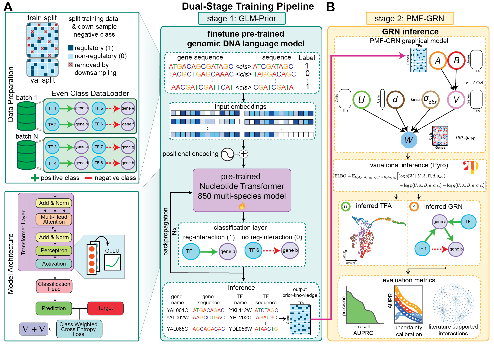

# GLM-Prior: a transformer-based nucleotide sequence classification model for inference of prior-knowledge GRNs. 
-----------

This repository and its references contain the models, data, and scripts used to perform the experiments in the 
GLM-Prior paper.



------------
## Installation Steps
Please create the following Conda environment within a singularity container:
```
conda create -p /ext3/pmf-prior-network python=3.10 -y
pip install torch==2.3.1 torchvision==0.18.1 torchaudio==2.3.1 --index-url https://download.pytorch.org/whl/cu121
pip install hydra-core pandas
pip install datasets
pip install scikit-learn
pip install transformers
pip install transformers[torch]
pip install wandb
```

To use this environment, run the following command:
```
singularity exec --nv --overlay /scratch/$USER/GLM-Prior/envs/overlay-15GB-500K.ext3:ro \
--bind /scratch/$USER/GLM-Prior/envs/local:$HOME/.local \
/scratch/work/public/singularity/cuda12.1.1-cudnn8.9.0-devel-ubuntu22.04.2.sif /bin/bash
``` 

Then, please install the remaining requirements using the `environment_prior_network.yaml` file:
```
conda env update --prefix /ext3/pmf-prior-network --file environment_prior_network.yaml --prune
```

Finally, activate by sourcing the environment:
```
source /ext3/env.sh
conda activate /ext3/pmf-prior-network
```

## Create gene and TF sequence files and priors associated with the GLM-Prior paper:
Notebooks for each of the three species (yeast, mouse and human) can be found in the `create_sequence_datasets/` folder. 
Instructions and links on necessary genome, fasta, motif and adjacent datasets to download can be found within each of the respective notebooks.

## GLM-Prior Pipeline (stage 1 of the dual-stage training pipeline)
To train a prior network from DNA sequences corresponding to transcription factors and target genes in a species or cell line of interest:
Step 1: Specify correct file paths in `config/train_prior_network_pipeline.yaml` and `config/prior_network/finetune_nt.yaml`
Step 2: Change the values for the singularity options in `config/train_prior_network_pipeline.yaml`. The options `prior_network_singularity_overlay` and `prior_network_singularity_img` should correspond to the Conda environment `pmf-prior-network`.
Step 3: Run the pipeline using the following command: `sbatch train_prior_network_pipeline.slurm TPN_pipeline`, where the second argument will specify which directory the experiment should be saved into.

The pipeline will dynamically create scripts to 
1. Create a tokenized dataset
2. Train GLM-Prior
3. Run inference on specified gene and TF sequences
4. Compute AUPRC of inferred GLM-Prior against a specified gold standard.

The inferred prior-network can be found in the output directory under `prior_network_predictions.tsv`. To binarize this prior-knowledge for downstream GRN inference, please use the optimal classification threshold obtained during training. Performance metrics will be logged to a specified weights and biases project, and final AUPRC will be saved to a `auprc_vs_gold.json` file in the output directory.

## Hyperparameter sweep for new datasets
To run a hyperparameter sweep on a new dataset and obtain the optimal hyperparameters for full training, we recommend sweeping over different values of class-weights and downsampling rates. Learning rates and gradient accumulation steps are also possible parameters to sweep over. To modify default sweep values, please modify the file `./train_prior_network/finetune_nt_hp_sweep.sh`. 

In the `config/prior_network/finetune_nt.yaml` file, please confirm all file paths are correct and that `num_train_epochs` is set to 1.

Submit dynamically created slurm jobs using the following command (1 job per sweep-run):

```
./train_prior_network/finetune_nt_hp_sweep.sh $USER /scratch/$USER/GLM-Prior/envs/overlay-15GB-500K.ext3 /scratch/work/public/singularity/cuda12.1.1-cudnn8.9.0-devel-ubuntu22.04.2.sif ./train_prior_network/hp-sweep/
```

A weights and biases project will be created to visualize the results of the hyperparameter sweep. Select the parameters corresponding to the run that achieved the best F1 score in Charts section

## GRN inference with PMF-GRN (stage 2 of the dual-stage training pipeline)

Once a prior-knowledge matrix has been inferred, GRN inference can be run using [](https://github.com/nyu-dl/pmf-grn), the second stage of the dual-stage training pipeline.
